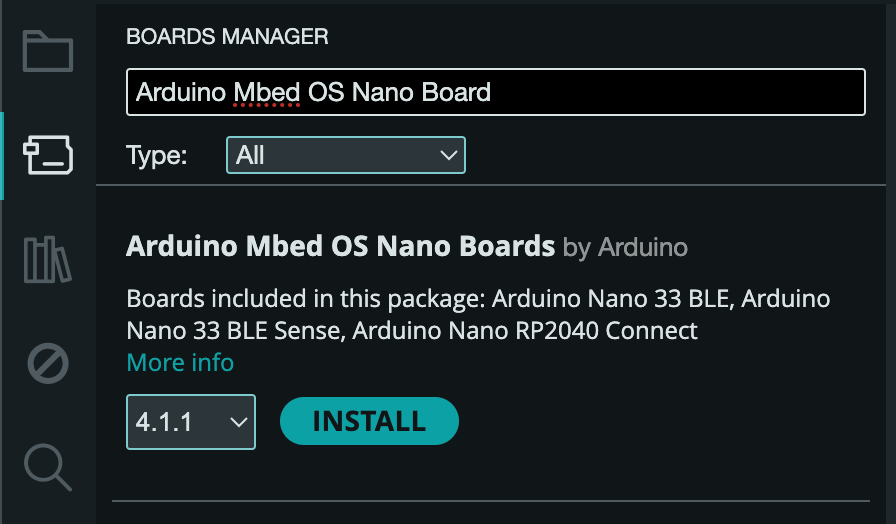

import Tabs from '@theme/Tabs'
import TabItem from '@theme/TabItem'

# ⚙️ Software Configuration

_How to connect your Octopus to Arduino IDE_

---

Depending on your Octopus, there are two different ways to configure Arduino IDE for development (Arduino Nano 33 BLE, and Arduino Nicla Vision). Both cases requires you to download libraries and configuring boards and ports to be able to flash the code needed for the ocotopus.

---

## Add the boards to your Arduino IDE

<Tabs>
  <TabItem value="ble" label="Nano 33 BLE" default>
    To add you board to the Arduino IDE you need to select **Tools menu > Board > Boards Manager**.

    Search for **Arduino Mbed OS Nano Board** and click "install".  

     

    ## Installing Drivers for the Boards

    With the Mbed OS core installed you can procees with the driver installation.

    **Open your fist sketch**

    Open the HelloOctopus example sketch: **File > Examples > Octopus Nano > HelloOctopus**. The sketch will appear in a new window.

    **Select your board type and port**

    You'll need to select the entry in the Board menu that corresponds to your Arduino board:

    **Tools > Board > ArduinoMbed OS Nano Boards > Arduino Nano 33 BLE**

  </TabItem>
  <TabItem value="nicla" label="Nicla Vision">
     For the examples provided with the Octopus, we are using [OpenMV IDE](https://openmv.io/pages/download) for development in micropython. 

     Go to the **"Download and install OpenMV IDE"** in the [Software installation guide](../firmware/SoftwareInstallation.md).  
  </TabItem>
</Tabs>

